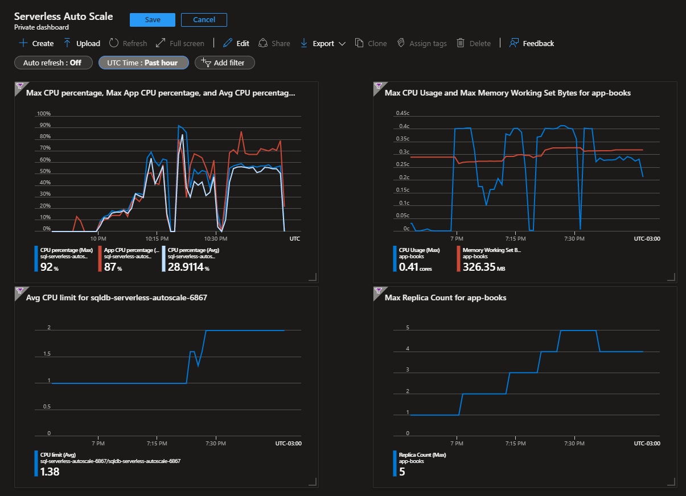

# Azure Serverless Auto Scaling

Container Apps and SQL Server Serverless operating with auto-scale.



## Setup the Infrastructure

To create the infrastructure simply enter the `infra` directory and apply:

```sh
cd infra

terraform init
terraform apply -auto-approve
```

The setup has default variables that you can override with an `.auto.tfvars` file:

```hcl
# Resources
location = "eastus2"

# SQL Server
sqlserver_version                     = "12.0"
sqlserver_max_size_gb                 = 10
sqlserver_sku_name                    = "GP_S_Gen5_2"
sqlserver_auto_pause_delay_in_minutes = 60
sqlserver_min_capacity                = 0.5
sqlserver_zone_redundant              = false

# Apps
app_cpu                            = 0.5
app_memory                         = "1.0Gi"
app_min_replicas                   = 1
app_max_replicas                   = 20
app_auto_scale_concurrent_requests = 50
auto_scale_cpu                     = 50

```

Simply run a load testing tool to view the application metrics. Example with K6:

```sh
k6 run \
    -e HOST_URL="https://<address>" \
    --vus 100 \
    --duration 500s \
    http_post.js
```

## Local Development

Setup for local development:

```sh
cd app

docker run -e "ACCEPT_EULA=Y" -e "MSSQL_SA_PASSWORD=P4ssw0rd#777" -p 1433:1433 -d mcr.microsoft.com/mssql/server:2022-latest

mvn spring-boot:run -Dspring-boot.run.profiles=dev
```

## Update Docker image

```sh
cd app

docker build . -t epomatti/azure-sqlserverless-books
docker login --username=epomatti
docker push epomatti/azure-sqlserverless-books
```

## References

- https://www.docker.com/blog/9-tips-for-containerizing-your-spring-boot-code/
- https://techcommunity.microsoft.com/t5/apps-on-azure-blog/azure-container-apps-virtual-network-integration/ba-p/3096932
- https://learn.microsoft.com/en-us/rest/api/containerapps/managed-environments/create-or-update?tabs=HTTP#vnetconfiguration
- https://sameeraman.wordpress.com/2019/10/30/azure-private-link-vs-azure-service-endpoints/
- https://azure.microsoft.com/pt-br/blog/optimize-price-performance-with-compute-auto-scaling-in-azure-sql-database-serverless/